# Домашнее задание к занятию «Организация сети» — Муравский Артем

---

### Часть 1. Yandex Cloud

Создан VPC (network) с подсетями:

1. public — `192.168.10.0/24`
2. private — `192.168.20.0/24`

Поднят NAT-инстанс со статическим адресом `192.168.10.254` и route table для private-подсети (`0.0.0.0/0 → 192.168.10.254`).

Создано две виртуалки:

- `public-instance` — в public-подсети, с внешним IP
- `private-instance` — в private-подсети, без внешнего IP

Схема сети:
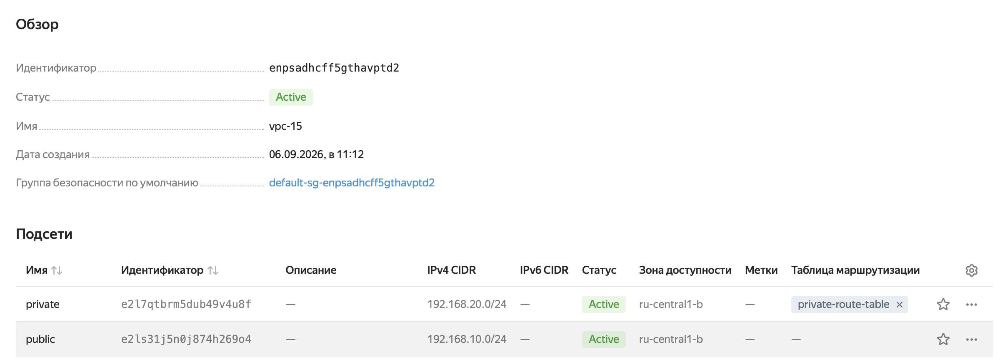
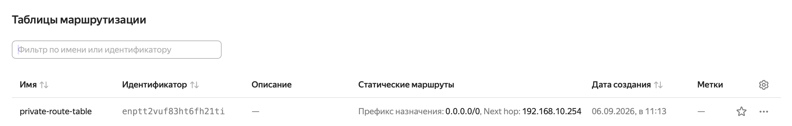

NAT-инстанс:


Публичная ВМ:


Приватная ВМ (без внешнего IP):


SSH-доступ к публичной ВМ:
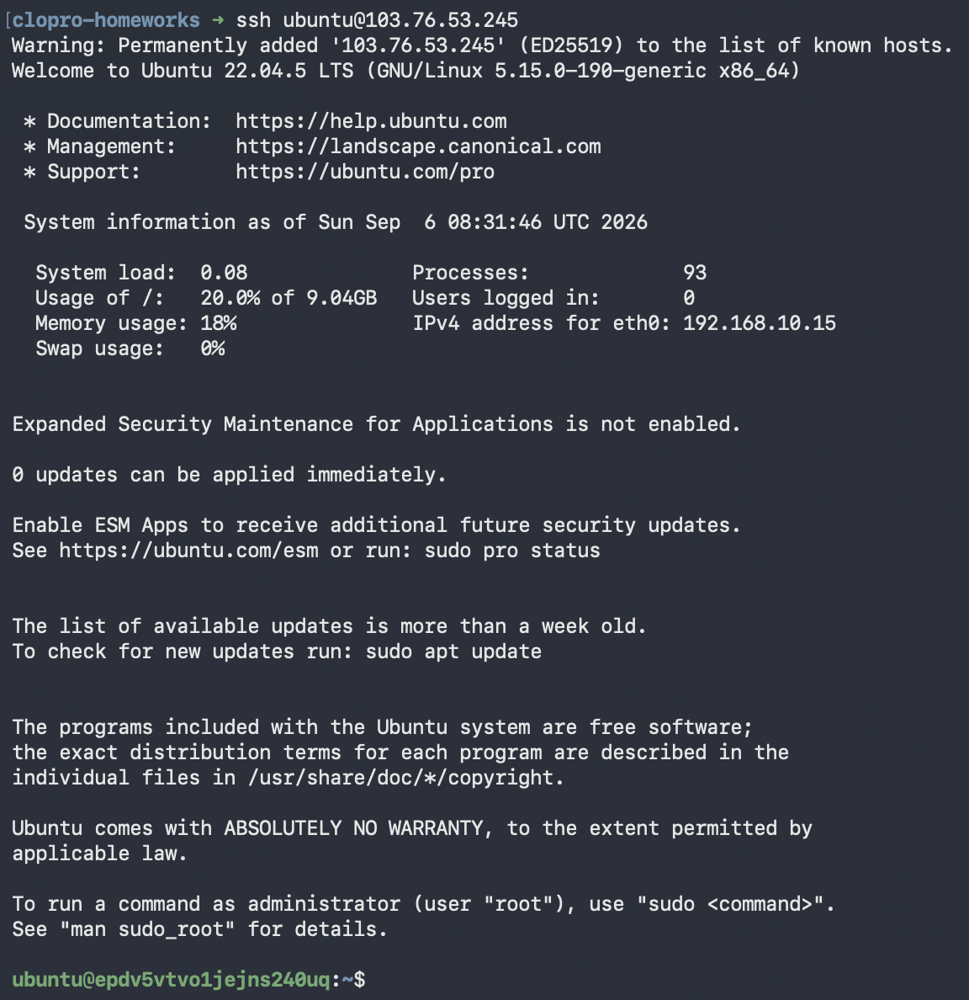

Интернет из приватной ВМ через NAT:
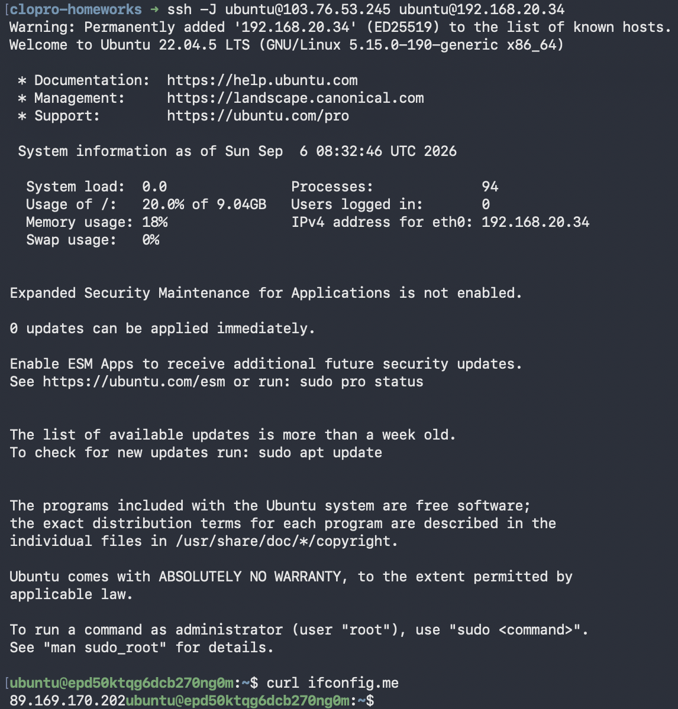

---

### Часть 2. AWS

Создан VPC `vpc-15` (`10.10.0.0/16`) с подсетями:

1. public-subnet — `10.10.1.0/24` (AZ `eu-north-1a`)
2. private-subnet — `10.10.2.0/24` (AZ `eu-north-1b`)

Созданы:

3. Internet Gateway + route table `public-rt` (`0.0.0.0/0 → igw`)
4. NAT Gateway с Elastic IP + route table `private-rt` (`0.0.0.0/0 → nat`)
5. Security Group `15` (SSH 22/tcp + ICMP)
6. Два EC2-инстанса: `bastion` (с публичным IP) и `private` (без публичного IP)

VPC:
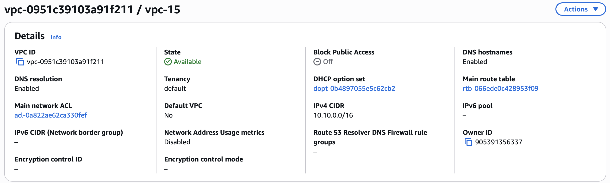

Публичная подсеть:
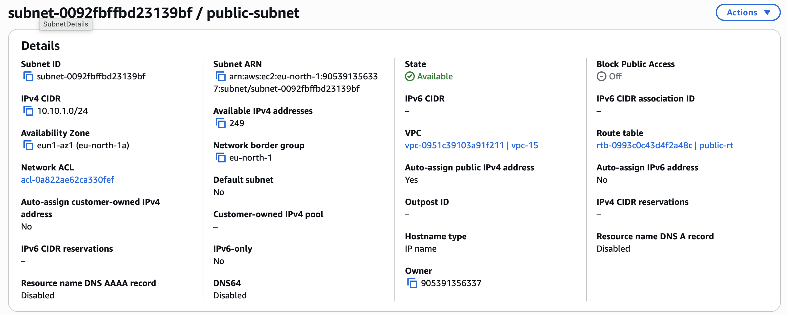

Приватная подсеть:
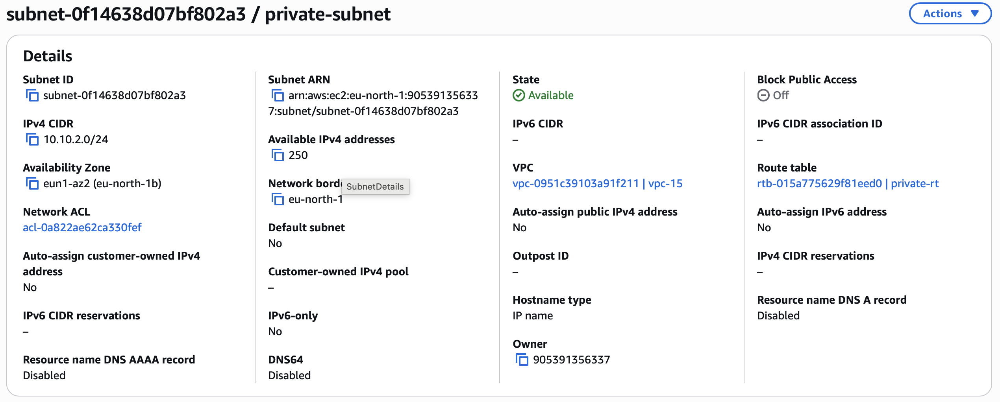

Публичная таблица маршрутизации и ассоциация с подсетью:
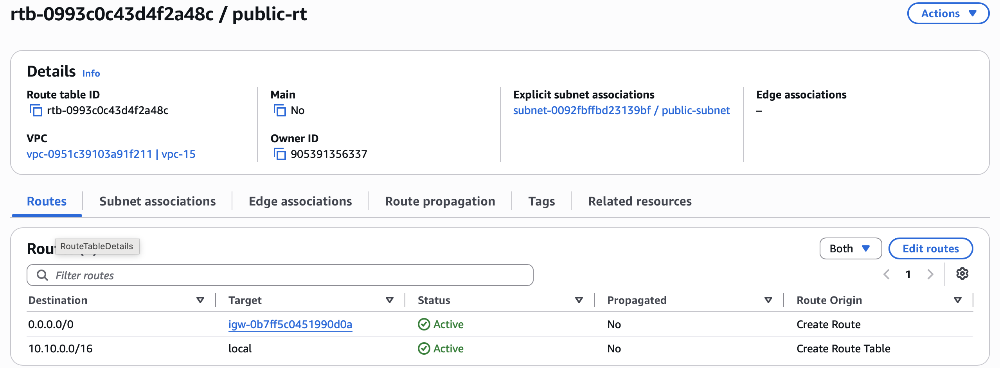


Приватная таблица маршрутизации и ассоциация с подсетью:
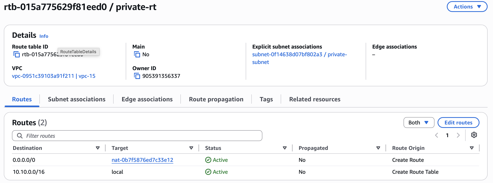
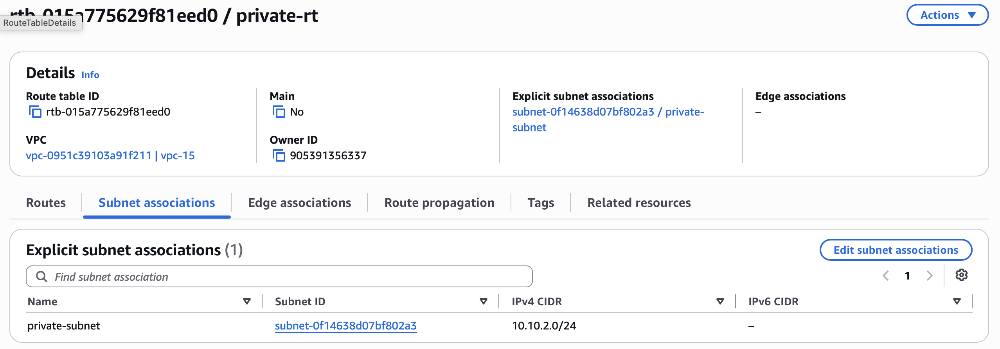

NAT Gateway и Elastic IP:
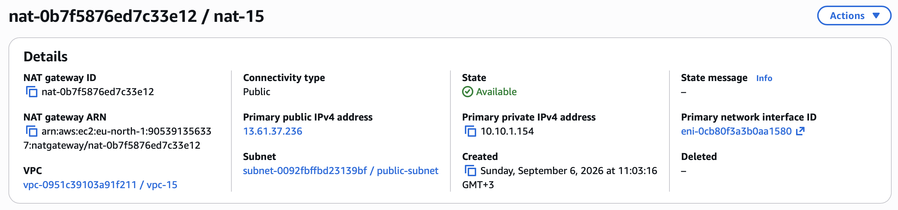
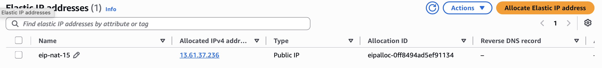

EC2 `bastion` и `private`:
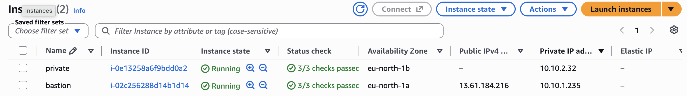

SSH-доступ к публичной (bastion) ВМ:
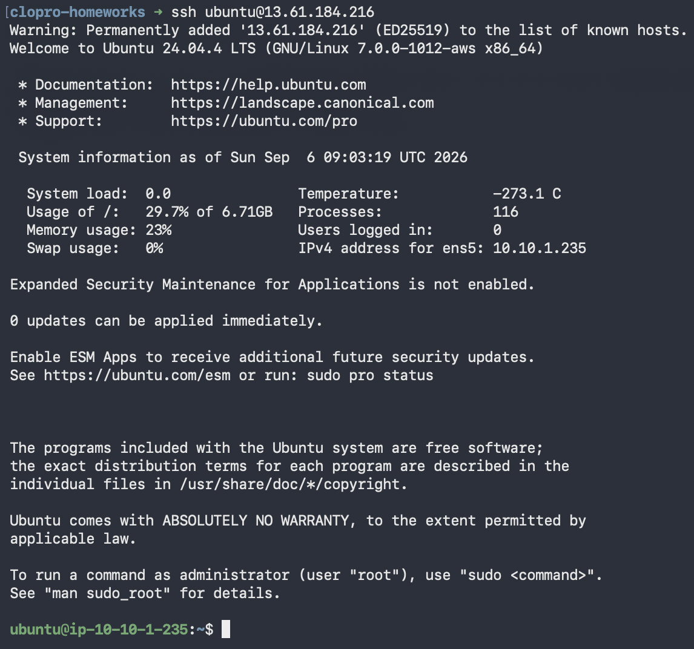

Интернет из приватной ВМ через NAT:
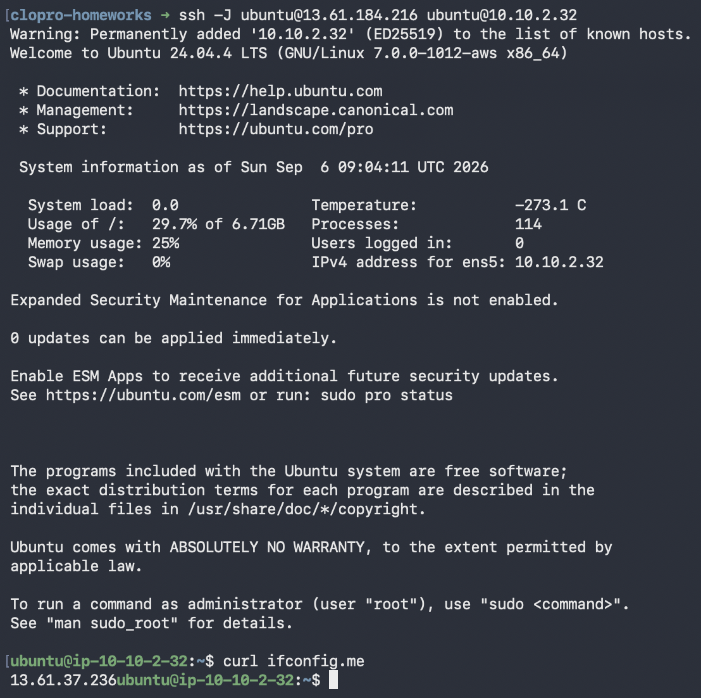

---

### Команды

Конфигурация лежит в папках `yandex-cloud/` и `aws/`, запускается независимо:

```bash
cd yandex-cloud && terraform init && terraform apply
cd aws && terraform init && terraform apply
```

Проверка NAT:

```bash
# Yandex Cloud: вход приватную ВМ посредством туннеля через публичную
ssh -J ubuntu@<внешний_ip_nat> ubuntu@192.168.20.x
curl ifconfig.me

# AWS: вход приватную ВМ посредством туннеля через публичную (бастион)
ssh -J ubuntu@<bastion_public_ip> ubuntu@10.10.2.x
curl ifconfig.me
```

Уборка ресурсов:

```bash
cd yandex-cloud && terraform destroy
cd aws && terraform destroy
```
